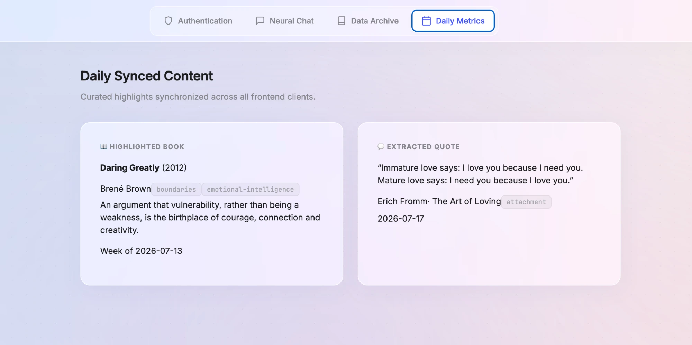
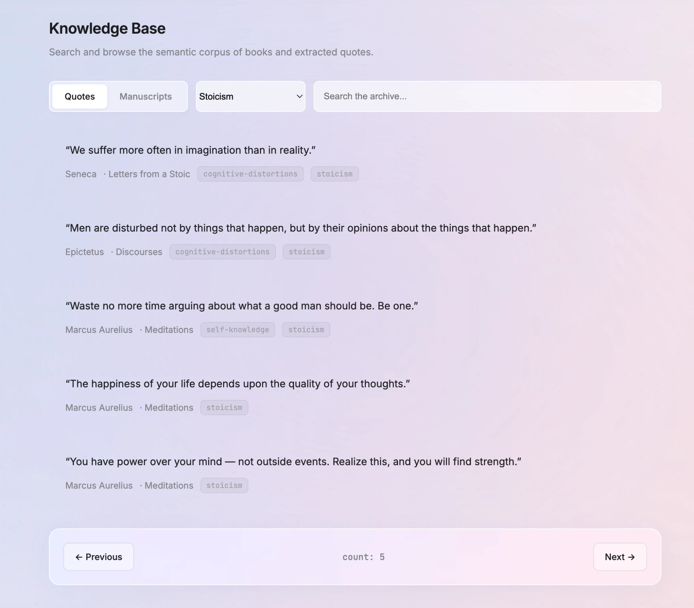
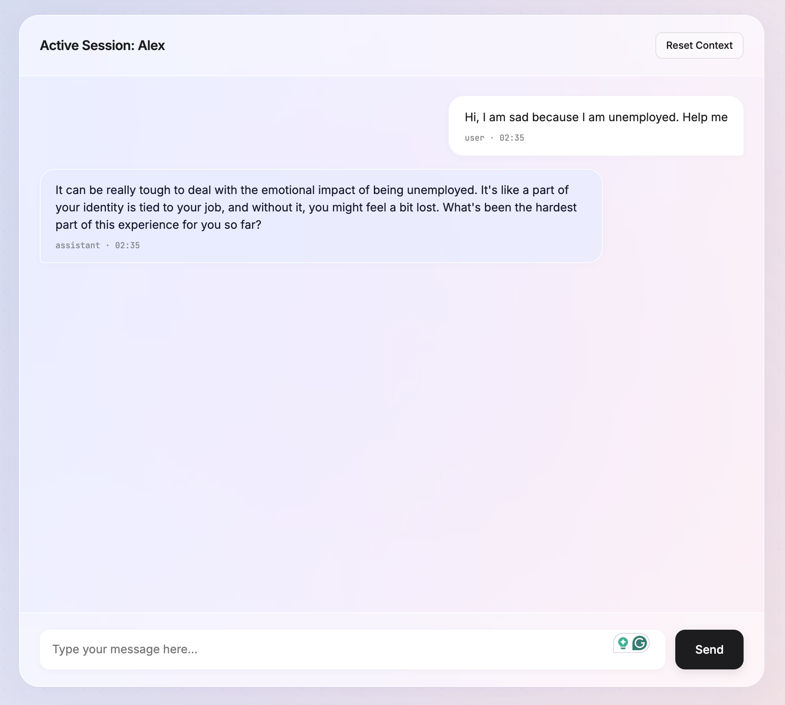

# Psychology Companion

An AI companion for talking through everyday psychology and emotional struggles — not a
therapist, not a diagnosis engine. It listens, asks guiding questions, and occasionally
brings in a relevant quote or book from a curated library. Django REST Framework API backend,
Groq-powered (`llama-3.3-70b-versatile`) via OpenAI-compatible function calling.

## Screenshots

<table>
  <tr>
    <td align="center" width="33%">
      <br>
      <sub><b>Today</b> — featured book + quote of the day</sub>
    </td>
    <td align="center" width="33%">
      <br>
      <sub><b>Library</b> — quote/book archive, filterable by category</sub>
    </td>
    <td align="center" width="33%">
      <br>
      <sub><b>Chat</b> — a conversation with Alex</sub>
    </td>
  </tr>
</table>

*From the dev-only test console (`/test-console/`, gated on `DEBUG=True`) — used to exercise the
full API by hand without a separate frontend.*

## Stack

- **Backend:** Django + Django REST Framework (API-only, JSON)
- **Database:** PostgreSQL
- **Cache / broker:** Redis, also backing Celery and DRF throttling
- **LLM:** Groq API, function calling for quote/book lookup
- **Auth:** SimpleJWT 
- **Scheduled jobs:** Celery + Celery Beat (Book of the Week, Quote of the Day rotation)
- **API docs:** `drf-spectacular` (OpenAPI schema, Swagger UI, Redoc)

## Setup

```bash
cp .env.example .env        # fill in GROQ_API_KEY at minimum
docker compose up -d
docker compose exec web python manage.py migrate
docker compose exec web python manage.py seed_quotes
docker compose exec web python manage.py seed_books
docker compose exec web python manage.py createsuperuser  
```

The `web` service serves the API at `http://localhost:8000`; `celery` runs both the worker and
beat scheduler for the weekly/daily featured-content rotation.

## Rate limits

Groq's free tier for `llama-3.3-70b-versatile` is a single shared budget across the whole API
key (not per-user): 30 requests/minute, 1000 requests/day, 12K tokens/minute. A single chat
message can cost more than one Groq call (tool-calling round-trips, plus an occasional summary
rollup), so `ChatMessageListCreateView` is throttled at `15/minute` per user
(`DEFAULT_THROTTLE_RATES["chat_message"]` in `config/settings/base.py`) — enough headroom for a
live conversation without one user exhausting the shared quota. `quotes`/`authors`/`categories`/
`books` fall under the global `AnonRateThrottle` (120/min) and `UserRateThrottle` (300/min).
